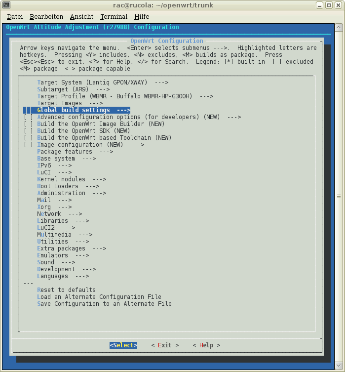

# HangZhou GDG DevFest Openwrt
###定制开发Openwrt路由器的点滴

###**Main Content**
- OpenWrt aria2
- Openwrt shadowsocks
- Openwrt owncloud
- Openwrt nginx php mysql
- Openwrt PPTP VPN
- Openwrt AP+WDS
- Openwrt make && make luci

# OpenWrt aria2

**aria2 is a lightweight multi-protocol & multi-source command-line download utility. It supports HTTP/HTTPS, FTP, BitTorrent and Metalink. aria2 can be manipulated via built-in JSON-RPC and XML-RPC interfaces.**

- **Multi-Connection Download.** aria2 can download a file from multiple sources/protocols and tries to utilize your maximum download bandwidth. Really speeds up your download experience.
- **Lightweight.** aria2 doesn’t require much memory and CPU time. When disk cache is off, the physical memory usage is typically 4MiB (normal HTTP/FTP downloads) to 9MiB (BitTorrent downloads). CPU usage in BitTorrent with download speed of 2.8MiB/sec is around 6%.
- **Fully Featured BitTorrent Client.** All features you want in BitTorrent client are available: DHT, PEX, Encryption, Magnet URI, Web-Seeding, Selective Downloads, Local Peer Discovery and UDP tracker.
- **Metalink Enabled.** aria2 supports The Metalink Download Description Format (aka Metalink v4), Metalink version 3 and Metalink/HTTP. Metalink offers the file verification, HTTP/FTP/BitTorrent integration and the various configurations for language, location, OS, etc.
- **Remote Control.** aria2 supports RPC interface to control the aria2 process. The supported interfaces are JSON-RPC (over HTTP and WebSocket) and XML-RPC.

# Openwrt shadowsocks

**A secure socks5 proxy, designed to protect your Internet traffic.**

- **Super Fast** Bleeding edge techniques with Asynchronous I/O and Event-driven programming.
- **Flexible Encryption** All traffic encrypted with industry level encryption algorithms. Flexible to support custom algorithms.
- **Mobile Ready** Optimized for mobile device and wireless network, without keep-alive connections.
- **Cross Platform** Avaliable on multiple platforms, including PC, MAC, Mobile (Android and iOS) and Routers (OpenWRT).
- **Open Source** Open source community with multiple implementations in python, node.js, golang, C#, and pure C.
- **Easy Deployment** Easy deployment with pip, npm, aur, freshports and many other package manager systems.

# Openwrt owncloud

**With ownCloud you can sync & share your files, calendar, contacts and more.
Access your data from all your devices, on an open platform you can extend and modify.**

- **Protect** ownCloud gives you control over your data. You decide what is shared with who and for how long.
- **Access** Access your data from your web browser, Android or iOS devices and your laptop and desktop.
- **Extend** Add apps, external storage, or your own code! Join the friendly open source community and get started!

# Openwrt nginx php mysql

**Set up a LAMP stack on OpenWrt**

- **nginx** nginx [engine x] is an HTTP and reverse proxy server, as well as a mail proxy server, written by Igor Sysoev. For a long time, it has been running on many heavily loaded Russian sites including Yandex, Mail.Ru, VK, and Rambler. 
- **php** PHP is a popular general-purpose scripting language that is especially suited to web development.
- **mysql** MySQL is a database system used on the web MySQL is a database system that runs on a server MySQL is ideal for both small and large applications MySQL is very fast, reliable, and easy to use

# Openwrt PPTP VPN
 **EVERYONE DESERVES A FREE PPTP VPN ACCESS TO ANYWHERE**

- **Protocol description** nA PPTP tunnel is instantiated by communication to the peer on TCP port 1723. This TCP connection is then used to initiate and manage a second GRE tunnel to the same peer.
- **Implementations** PPTP was the first VPN protocol that was supported by Microsoft Dial-up Networking. All releases of Microsoft Windows since Windows 95 OSR2 are bundled with a PPTP client, although they are limited to only 2 concurrent outbound connections. Microsoft Windows Mobile 2003 and higher also support the PPTP protocol. The Routing and Remote Access Service for Microsoft Windows contains a PPTP server. The Microsoft implementation uses single DES in the MS-CHAP authentication protocol which many find unsuitable for data protection needs.
- **Security** PPTP has been the subject of many security analyses and serious security vulnerabilities have been found in the protocol. The known vulnerabilities relate to the underlying PPP authentication protocols used, the design of the MPPE protocol as well as the integration between MPPE and PPP authentication for session key establishment.

# Openwrt AP+WDS
 **OpenWRT using AP+WDS mode to build a wireless relay**

- **AP1 (principal) configuration:** 1.DHCP open; 2 wireless Mode select AP+WDS; 3 fixed channel
- **AP2 (guest) configuration:** 1 off DHCP; 2 two wireless Mode were selected for Client (WDS) and AP. The two router subnet cannot be the same (like I AP1 is set to 192.168.1.1, AP2 is set to 192.168.2.1 segment)

#Openwrt make && make luci

##Requirement
to generate an installable OpenWrt firmware image file with a size of e.g. 8MB:

1. Install OpenWrt Buildroot and its prerequisites on your OS.
2. ca. 3-4 GB of available hard disk space
3. environment variables:
 - SED should not be set. If it is, run `unset SED` before compiling. 
 - GREP_OPTIONS should not have –initial-tab or other options affecting its output
 - Add <buildroot dir>/staging_dir/host/bin and <buildroot dir>/staging_dir/toolchain-<platform>-<gcc_ver>-<libc_ver>/bin in front of your PATH variable in ~/.bashrc. The staging directory is created shortly after starting the build and the toolchain directory is created when the toolchain build begins. The build spawns multiple shells, some of which expect the toolchain binaries to be present in the PATH.

##Installation
before you install Openwrt , you should be root

    #su root

then install need package:

    #yum install libncurses5-dev zlib1g-dev bison flex unzip autoconf gawk make  gettext gettext texinfo sharutils gcc binutils ncurses-term patch bzip2 libbz2-dev libz-dev asciidoc subversion sphinxsearch libtool git git-core curl ncurses-devel zlib-devel gcc-c++ openssl-devel 

you can add user openwrt and set password 
   
    adduser  openwrt
    passwd  openwrt
    su openwrt
get from svn git
   
    cd ~
    git clone https://github.com/crysisx/GDG-DevFest-2014-OpenWrt.git
    cd GDG-DevFest-2014-OpenWrt

Updating Feeds

    ./scripts/feeds update -a
    ./scripts/feeds install -a
The OpenWrt Buildroot configuration interface handles the selection of the target platform, packages to be compiled, packages to be included in the firmware file, some kernel options, choose what you need package and luci 

###then Defconfig
   
    make defconfig
###then Defconfig
   
    make prereq
###then Defconfig
   
    make menuconfig

###Building Images
    
    make V=99

###Locating Images

After a successful build, the freshly built image(s) can be found in the newly created <buildroot_dir>/bin directory. The compiled files are additionally classified by the target platform, so e.g. a firmware built for an ar71xx device will be located in <buildroot_dir>/bin/ar71xx directory.

##Cleaning Up  
###Clean 
 
    make Dirclean
deletes contents of the directories /bin and /build_dir. make clean does not remove the toolchain, it also avoids cleaning architectures/targets other than the one you have selected in your .config
###Dirclean
   
    make dirclean
deletes contents of the directories /bin and /build_dir and additionally /staging_dir and /toolchain (=the cross-compile tools) and /logs. 'Dirclean' is your basic "Full clean" operation.
###Distclean

    make distclean
nukes everything you have compiled or configured and also deletes all downloaded feeds contents and package sources.
# 杭州GDG DevFest 2014

## GDG 谷歌开发者节简介

杭州GDG承办的DevFest（谷歌开发者节）活动，是Google每年秋季在全球GDG（谷歌开发者社区）推行的，针对Google技术开发者、爱好者所举办的技术交流活动。
其主要目的在于同步Google各种先进技术（包括Android、Chrome、Google Map、HTML5、Golang等），并进行推广与应用，促进本地社区成员的交流。
DevFest活动除设置有吸引力的主题分享，还有互动参与环节，同时会有部分Google I/O设备展示，对于Google技术开发者、爱好者都是不可错过的体验机会。 

## 举办时间

时间：10月25日(周六) 13：30至21：00，分为下午技术分享交流环节及可选的编码练习或游戏环节

## 举办地点

地点：西湖区文二西路西城广场（具体地址会在G+消息及邮件中告知）

##简要日程

- 13:30-13:50 签到
- 13:50-14:00 DevFest 活动及杭州GDG简介
- 14:00-14:40 《Android Wear开发或App的话题》 
Oasis Feng，在双十一前挤出时间，诚意满满，精彩内容，不可错过。
- 14:50-15:30 《定制开发Openwrt路由器的点滴》 
Zooboa，已多次为杭州GDG活动提供Freedom网络服务，来体验吧。
- 15:40-15:50 合影
- 15:50-16:20 茶歇及设备：Android Watch/TV、Chrome Pixel等体验
- 16:20-16:30 活动纪念品领取
- 16:30-17:30 Android(Watch/TV) Code Labs(需自带Android 4.4W开发环境)
- 17:30-18:10 晚上简餐(报名参与Code Labs的成员)
- 18:20-19:00 Code Labs的成果或成员开发的App现场演示
杭州GDG，针对其中完成度较高的App，将协助上传到Google Play并做推广。
- 19:00-20:45 Ingress Hangzhou 面基&PK Again

##Contact

- **Author:crysisx**
- **Web-site:www.hdume.com**
- **Twitter:yangyongxin@crysisx**
- **Facebook:yangyongxin**
- **Google+:crysisx**
- **Mail:yyx843984246@gmail.com&&yyx@betahouse.us**

##Reference

- https://openwrt.org
- http://www.shadowsocks.net
- http://owncloud.org
- https://wiki.archlinux.org/index.php/Aria2c

